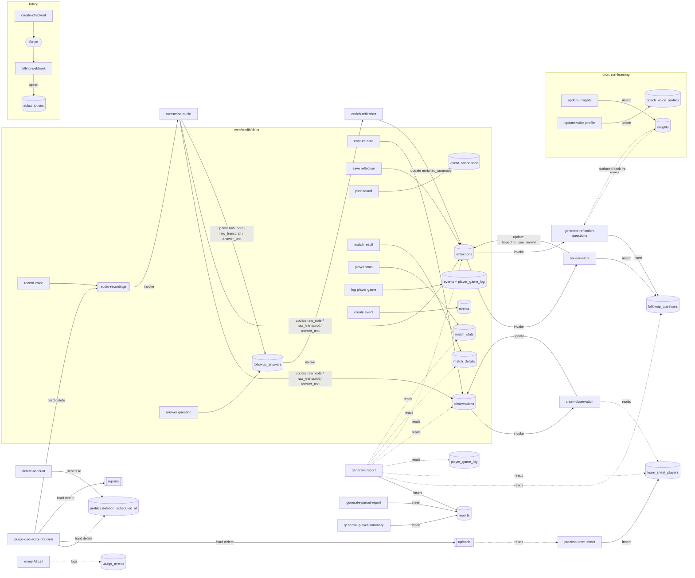

# Reflective Lens — System Audit (pipeline, contracts, data boundaries)

Date: 2026-07-24. Scope: all 16 edge functions, the 4 shared helpers, the 12
migrations, and `web/src` (db layer + screens). Method: full read of every edge
function and helper, schema cross-check on PG16 column definitions, two parallel
read-only sweeps (storage/data-flow map; PII + prompt duplication), plus targeted
greps to confirm each headline claim first-hand.

**This is an audit only. No code was changed to produce it.** Findings carry a
severity and a *how-to-confirm-at-runtime* note. Per the rule "nothing marked
fixed on inspection alone", every fix in the phase-2 plan lists a runnable check.
Fixes are proposed, not applied.

Legend: **Crit** = data loss / PII / a blank or wrong artefact reaching a
coach or player. **High** = silent wrong/empty on a path users actually hit.
**Med** = latent drift, duplication, cost. **Low** = cosmetic / robustness.

---

## 1. The map (entry point → workflow → storage)

The multi-writer hotspots (where shape drift bites) are **`reports`**,
**`reflections`**, **`observations`**, **`followup_questions`**, and the
**squad** concept, which is split across two unrelated stores (see F5).

---

## 2. Data boundaries — youth PII (the one that can't ship broken)

**F1 — Youth player names and "these are minors" reach third-party models. (High)**
Player-identifying data is sent to Anthropic/OpenAI in several places:
- `process-team-sheet/index.ts:52` — the full roster (names + shirt + position) is the prompt.
- `generate-report/index.ts:88-89` — `match_stats` carries `players(display_name)`; `roster` ships the full `team_sheet_players` rows (name/shirt/position).
- `generate-period-report/index.ts:105,97` — per-player `display_name` **plus `team.age_group` (e.g. "U12")**; together this tells the model the named people are children.
- `transcribe-audio` — spoken audio naming players goes to OpenAI (a second processor).
- Free-text notes/reflections (`clean-observation`, `review-intent`, `enrich-reflection`, both report generators) can embed names the coach typed/spoke.
Confirm: assert the JSON handed to `callClaude` for team/period reports contains no `display_name`/`player_name`. Direction: pass shirt numbers or opaque ids for stats/roster; drop or generalise `age_group`; consider a proper-noun redaction pass on free-text at youth level; document the processor list and retention. **Needs a decision on retention/DPA posture (Q6).**

**F2 — Report content is written to logs. (Crit)**
`generate-report/index.ts:148-152` logs `head: raw.slice(0,300)` — the first 300
characters of the model's report reply, which routinely contains player names and
note text — to `console.error`. That is youth PII in the function logs.
Confirm: unit-check the log call emits only `event_id` + `length`. Fix: drop `head`.

**F3 — usage_events is clean (positive).**
Only UUIDs (`user_id`, `club_id`, `team_id`) and token/cost numbers are stored;
`metadata` is never populated with free text. No change needed; keep it that way.

---

## 3. Contract audit — what a stage emits vs what the next assumes

**F4 — The structured reflection fields are read everywhere and written nowhere. (Crit)**
`reflections.what_went_well`, `what_did_not_work`, `learning_evidence`,
`action_points`, `suggested_next_focus` are `jsonb default '[]'`. They are **read**
by `enrich-reflection`, `generate-reflection-questions`, `generate-player-summary`,
`generate-period-report`. They are **written by nothing** — `saveTextReflection`
sets only `{raw_transcript, summary}` (both to the same text); `saveVoiceReflection`
sets `{audio_path}` and never sets `summary` at all. So every reader consumes empty
arrays, and voice reflections have a null `summary`. Player summaries built from
`went_well`/`didnt` are structurally empty. This looks like a missing
"structure-a-reflection" step (the reflection analogue of `clean-observation`), or
the readers should stop expecting these fields. **Needs input (Q1): deliberately
unfinished, or a gap?** Confirm: integration test — save a reflection, assert the
fields a report reads are populated before generation.

**F5 — "The squad" is two disconnected systems. (High)**
The coach squad UI writes `event_attendance` (`{event_id, player_id, status,
selection}`, `db.ts:200`). Everything AI reads the *other* store:
`clean-observation:64` attributes a shirt-numbered note via
`team_sheet_players.player_id`; `generate-report:36` builds its `roster` from
`team_sheet_players`. That store is only written by `process-team-sheet`, whose
OCR is a stub (`ocr()` returns `""`) and which inserts `player_name` **without a
`player_id`** — so the attribution join (`.not("player_id","is",null)`) essentially
never matches, and report `roster` is empty because the squad UI never writes
`team_sheet_players`. Result: shirt-number attribution and report rosters are
silently non-functional. **Needs input (Q2): which store is canonical?** Direction:
make `event_attendance` (joined to `players`) the single source; rewire attribution
and roster to it; retire or repurpose `team_sheet_players`. Confirm: set a squad in
the UI, add a shirt-numbered note, generate a report — assert the note attributes to
a player and the roster is populated.

**F6 — Team-scoped player summaries are invisible. (Med)**
`playerSummaries()` (`db.ts:458`) reads `reports WHERE event_id IS NULL AND team_id
IS NULL`. But `generate-player-summary:118` sets `team_id` when the summary is
scoped to one of the player's teams. Those summaries are written with a non-null
`team_id` and never appear in the list. Confirm: create a team-scoped player
summary, assert it shows. Fix: filter player summaries by `created_by` + null
`event_id` (+ `report_type in weekly/monthly/season`), not by null `team_id`.

**F7 — Two different columns are both surfaced as "phase". (Med)**
`observations` has `capture_phase` (enum: live/half-time/post, set at capture) and
`phase_of_play` (AI tactical phase, set by clean-observation). `generate-report`
shows `phase_of_play`; `review-intent` and `generate-period-report` show
`capture_phase`. Both are populated, so nothing breaks, but the reports disagree on
what "phase" means. Decide one per surface.

**F8 — Capture fields the report reads are never set. (Low)**
`generate-report` reads `o.match_minute`, `o.timestamp_seconds`, `o.subject_type`,
`o.shirt_number`; the capture UI never sets them (defaults). Reports get
null/default there. Confirm intended, or wire the capture UI to collect them.

**F-events — player-game events lack coach intent fields (Low/expected).**
`createPlayerGame` writes events with no `hoping_to_see` and status `completed`;
`review-intent` is coach-only and correctly no-ops. Noted so it isn't rediscovered.

---

## 4. Ordering + idempotency — can a stage run twice / out of order / on partial data?

**F9 — update-insights duplicates its whole output every run. (Crit)**
`insights` has no natural-key uniqueness; `update-insights:116` does a raw
`.insert()` with no clear-before-write. It runs nightly *and* on new input, so each
pass re-inserts the same recurring themes. `insights` grows without bound and
`generate-reflection-questions` re-surfaces duplicates. Confirm: run the function
twice on the same data, assert row count is stable. Fix: a unique key on
`(user_id, team_id, player_id, tag, insight_type)` + upsert, or delete-then-insert
the user's insights per pass.

**F10 — Follow-up questions duplicate on retry. (High)**
`generate-reflection-questions` and `review-intent` both `.insert()` into
`followup_questions` for a reflection with no dedup. Reflection tools get retried;
a second invocation doubles the questions (and the two functions can each add sets).
Confirm: invoke twice, assert count stable. Fix: delete the reflection's existing
AI-generated questions before insert, or an idempotency guard keyed on the source.

**F11 — Reports duplicate on retry. (High)**
All three report generators `.insert()` a new `reports` row per call — no upsert, no
dedup. A retried "generate report" produces duplicate reports. Confirm: invoke
twice, assert one row. Fix: upsert on `(event_id, report_type)` for event reports
and `(created_by, team_id, report_type, period_start, period_end)` for
period/summary.

**F12 — A bad model reply can wipe a good voice profile. (High)**
`update-voice-profile:70` upserts unconditionally with `parsed.* ?? null`. If the
model returns empty/garbage, `safeParse` yields `{}` and the upsert overwrites an
existing profile with `style_summary=null, glossary=[]`. Confirm: feed empty model
output over an existing profile, assert it is preserved. Fix: only write when
`parsed.style_summary` is present; otherwise record a no-op.

**F13 — transcribe-audio clobbers unconditionally (Low).**
It overwrites the target column with the transcript on every run; a retry re-bills
Whisper and can overwrite a manual edit. Minor; note for cost/idempotency.

---

## 5. Failure behaviour — what a coach or player actually sees when a stage dies

**F19 — Silent-empty reports for players and teams. (Crit)**
`generate-report` was hardened to never store a blank report (structured-check →
fall back to raw text → log). `generate-period-report` and `generate-player-summary`
were **not**: on a parse failure `content_json` is `{}`, `toMarkdown` emits just
`# heading`, and a blank report is stored and shown. Silent empty output is the
worst outcome for a reflection tool. Confirm: feed an empty model reply, assert the
stored report has a body or a clear retry message. Fix: replicate generate-report's
guard in both.

**F20 — enrich-reflection can blank the enriched summary. (High)**
`enriched_summary = raw.trim()` with no empty guard; an empty reply stores `""`.
Confirm: empty reply, assert prior content preserved. Fix: skip the write when empty.

**F21 — review-intent can wipe the hoped-to-see review. (High)**
On parse failure `review = []` and it still `update`s `hoped_to_see_review` to `[]`,
erasing a prior good review, and inserts no gap questions. Confirm: empty reply,
assert prior review preserved. Fix: skip the write on parse failure.

**F22 — callClaude returns "" on an unexpected response shape. (Med)**
`data.content?.[0]?.text ?? ""` means every consumer must guard against empty; F19–F21
show several don't. Consider a distinct empty/failure signal so callers can branch.

**F23 — Frontend failure surface unverified. (Med, needs check)**
Edge functions return `{error}` + 500. Whether the UI shows a message vs a spinner or
a blank card on failure was not verified in this pass. Confirm by driving a failing
generate in the app.

---

## 6. Duplication sweep — one source of truth per concept

**F14 (Med)** "MIRROR, NOT VERDICT" is re-inlined in 8 functions with drifting
wording (`clean-observation:44`, `enrich-reflection:59`, `generate-reflection-questions:81/91`,
`review-intent:60`, `generate-report:101`, `generate-period-report:128`,
`generate-player-summary:94`, plus `knowledge.ts:69`). → one `_shared/principles.ts`.

**F15 (Med)** `safeParse` (the `raw.match(/\{...\}/)`+`JSON.parse` helper) is
copy-pasted in 8 functions. → one `_shared/json.ts`.

**F16 (Med)** `toMarkdown` exists in three near-identical copies
(`generate-report`, `generate-period-report`, `generate-player-summary`),
diverging only in headings. → one parameterised renderer.

**F17 (Low)** `constantTimeEqual` (`clients.ts:111`) is byte-identical to
`timingSafeEqual` (`billing-webhook:117`); `run-learning:24` compares the cron
secret with a plain `!==` (not constant-time). Consolidate and use the constant-time
compare everywhere.

**F18 (Low)** Model tiering has two sources: the `MODELS` map (`clients.ts:37`) and
the `model_config` table (migration 0010). `model_config` is authoritative at
runtime; `MODELS` is now only a fallback default. Document that, or generate one
from the other, so they can't drift.

---

## 7. Token audit (done last, on purpose)

**F24 (Med)** `generate-report:77` spreads the **entire** reflection row
(`...reflections[0]`, incl. `raw_transcript`) into the prompt, on top of the full
roster and every observation. Trim to the fields the report needs.

**F25 (Med)** `generate-period-report` sends **every note** of the period verbatim
(`training_notes` + `match_notes`). A season report on an active team can approach or
exceed the context budget and cost. Cap, bucket, or pre-summarise. Confirm by
counting tokens on a full-season team.

**F26 (Low)** `generate-reflection-questions` sends `raw_transcript` **and**
`summary`, which for text reflections are the identical string
(`saveTextReflection` sets both equal) — duplicate content in one prompt. Dedup.

**F27 (Low)** `voiceInstruction` does two DB reads per AI call (profiles +
coach_voice_profiles). Fine at grassroots scale; batch if volume grows.

> Note the ordering discipline: cutting F24–F26 before F4/F5 are fixed would just
> hide the empty-field and squad-split bugs behind a smaller prompt. Contracts first.

---

## 8. Open questions (needed before phase-2 patching)

- **Q1 (gates F4/F19):** Are the structured reflection fields deliberately
  unfinished, or is a "structure-the-reflection" step missing?
- **Q2 (gates F5):** Which is the canonical squad store — `event_attendance` or
  `team_sheets`/`team_sheet_players`?
- **Q3 (most valuable):** Can you share one coach reflection and one player
  reflection you'd be happy to ship? It turns "is this correct?" into a comparison.
  If not, I can draft candidates from the current prompts for you to react to.
- **Q4 ("done"):** Target users / volume / failure tolerance? Sets how hard to push
  idempotency and token work.
- **Q5 (off-limits):** Which schemas, existing `reports` rows, or frontend API
  contracts are frozen?
- **Q6 (retention/PII):** Retention and processor rules per audience
  (coach / player / club / parent), given youth data — drives F1.

## 9. Who each workflow serves (for reference)

- **Coach**: capture → clean-observation; reflect → review-intent +
  generate-reflection-questions → enrich-reflection; per-event and per-period reports;
  voice profile + insights learned from their own writing.
- **Player**: private log → own reflection → player questions →
  generate-report (player_report) + generate-player-summary. Never mixed with coach.
- **Owner**: analytics dashboard, model tiering, cost guard (not a reflection path).
- **Club/parent**: no in-app path today (share by PDF export). Retention rules TBD (Q6).

---

## 10. Proposed phase-2 order (patch second — each fix ships with a runnable check)

1. **Stop PII bleed:** F2 (scrub the log), F1 (trim names/age to processors).
2. **No blank artefacts:** F19, F20, F21 (guards so nothing empty is ever stored).
3. **Idempotency:** F9 (insights), F10 (questions), F11 (reports), F12 (voice wipe).
4. **Contracts (after Q1/Q2):** F4 (reflection fields), F5 (one squad store), F6
   (player-summary visibility), F7 (phase).
5. **Consolidation:** F14–F18.
6. **Token:** F24–F26.

No item here is marked done until a test that actually runs demonstrates it: invoke
the function twice and assert stable rows (idempotency); feed an empty model reply
and assert prior content survives / a non-empty body is stored (failure); assert the
`callClaude` payload carries no names (PII).
